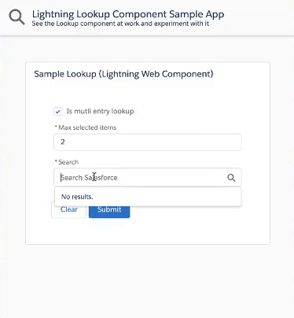
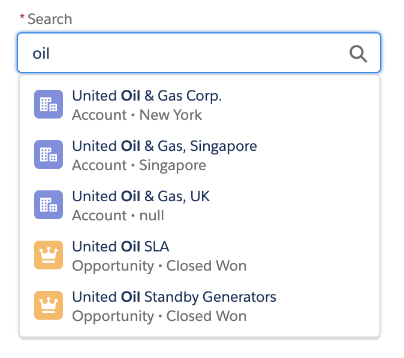
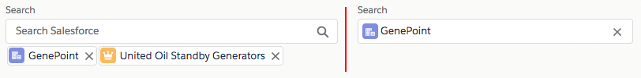

# Salesforce Lookup Component

[](https://github.com/pozil/sfdc-ui-lookup-lwc/actions) [](https://codecov.io/gh/pozil/sfdc-ui-lookup-lwc)

<p align="center">
    
</p>



1. [About](#about)
1. [Installation](#installation)
1. [Documentation](#documentation)
    1. [Getting started](#getting-started)
    1. [Handling selection changes (optional)](#handling-selection-changes-optional)
    1. [Providing default search results (optional)](#providing-default-search-results-optional)
1. [Reference](#reference)

## About

This is a generic &amp; customizable lookup component built using Salesforce [Lightning Web Components](https://developer.salesforce.com/docs/component-library/documentation/lwc) and [SLDS](https://www.lightningdesignsystem.com/) style.<br/>
It does not rely on third party libraries and you have full control over its datasource.

<b>Features</b>

The lookup component provides the following features:

-   customizable data source that can return mixed sObject types
-   single or multiple selection mode
-   client-side caching & request throttling
-   great test coverage
-   keyboard navigation
-   search term highlighting
-   ability to create new records

<p align="center">
    
</p>

## Installation

The default installation installs the lookup component and a sample application available under this URL (replace the domain):<br/>
`https://YOUR_DOMAIN.lightning.force.com/c/SampleLookupApp.app`

If you wish to install the project without the sample application, edit `sfdx-project.json` and remove the `src-sample` path.

Install the sample app by running this script:

**MacOS or Linux**

```
./install-dev.sh
```

**Windows**

```
install-dev.bat
```

## Documentation

### Getting Started

Follow these steps in order to use the lookup component:

1. **Write the search endpoint**

    Implement an Apex `@AuraEnabled(Cacheable=true)` method (`SampleLookupController.search` in our samples) that returns the search results as a `List<LookupSearchResult>`.
    The method name can be different but it needs to match this signature:

    ```apex
    @AuraEnabled(Cacheable=true)
    public static List<LookupSearchResult> search(String searchTerm, List<String> selectedIds) {}
    ```

1. **Import a reference to the search endpoint**

    Import a reference to the `search` Apex method in the lookup parent component's JS:

    ```js
    import apexSearch from '@salesforce/apex/SampleLookupController.search';
    ```

1. **Handle the search event and pass search results to the lookup**

    The lookup component exposes a `search` event that is fired when a search needs to be performed on the server-side.
    The parent component that contains the lookup must handle the `search` event:

    ```xml
    <c-lookup onsearch={handleSearch} label="Search" placeholder="Search Salesforce">
    </c-lookup>
    ```

    The `search` event handler calls the Apex `search` method and passes the results back to the lookup using the `setSearchResults(results)` function:

    ```js
    handleSearch(event) {
        const target = event.target;
        apexSearch(event.detail)
            .then(results => {
                target.setSearchResults(results);
            })
            .catch(error => {
                // TODO: handle error
            });
    }
    ```

### Handling selection changes (optional)

The lookup component exposes a `selectionchange` event that is fired when the selection of the lookup changes.
The parent component that contains the lookup can handle the `selectionchange` event:

```xml
<c-lookup onsearch={handleSearch} onselectionchange={handleSelectionChange}
    label="Search" placeholder="Search Salesforce">
</c-lookup>
```

The `selectionchange` event handler can then get the current selection form the event detail or by calling the `getSelection()` function:

```js
handleSelectionChange(event) {
    // Get the selected ids from the event (same interface as lightning-input-field)
    const selectedIds = event.detail;
    // Or, get the selection objects with ids, labels, icons...
    const selection = event.target.getSelection();
    // TODO: do something with the lookup selection
}
```

`getSelection()` always return a list of selected items.
That list contains a maximum of one element if the lookup is a single-entry lookup.

### Providing default search results (optional)

The lookup can return default search results with the `setDefaultResults(results)` function. This is typically used to return a list of recently viewed records (see sample app).

Here's how you can retrieve recent records and set them as default search results:

1. Implement an Apex endpoint that returns the recent records:

    ```apex
    @AuraEnabled(Cacheable=true)
    public static List<LookupSearchResult> getRecentlyViewed()
    ```

    See the [full code from the sample app](/src-sample/main/default/classes/SampleLookupController.cls#L59)

1. In your parent component, create a property that holds the default results:

    ```js
    recentlyViewed = [];
    ```

1. Write a utility function that sets your default search results:

    ```js
    initLookupDefaultResults() {
        // Make sure that the lookup is present and if so, set its default results
        const lookup = this.template.querySelector('c-lookup');
        if (lookup) {
            lookup.setDefaultResults(this.recentlyViewed);
        }
    }
    ```

1. Retrieve the recent records by calling your endpoint:

    ```js
    @wire(getRecentlyViewed)
    getRecentlyViewed({ data }) {
        if (data) {
            this.recentlyViewed = data;
            this.initLookupDefaultResults();
        }
    }
    ```

1. Initialize the lookup default results when the parent component loads:

    ```js
    connectedCallback() {
        this.initLookupDefaultResults();
    }
    ```

**Note:** `initLookupDefaultResults()` is called in two places because the wire could load before the lookup is rendered.

## Reference

### Attributes

| Attribute           | Type                                           | Description                                                                                                                                                                      |
| ------------------- | ---------------------------------------------- | -------------------------------------------------------------------------------------------------------------------------------------------------------------------------------- |
| `label`             | `String`                                       | Optional lookup label. Label is hidden if attribute is omitted.                                                                                                                  |
| `selection`         | `[LookupSearchResult]` OR `LookupSearchResult` | Lookup initial selection if any. Array for multi-entry lookup or an Object for single entry lookup.                                                                              |
| `placeholder`       | `String`                                       | Lookup placeholder text                                                                                                                                                          |
| `isMultiEntry`      | `Boolean`                                      | Whether the lookup is single (default) or multi entry.                                                                                                                           |
| `required`          | `Boolean`                                      | Whether the lookup is a required field. Note: Property can be set with `<c-lookup required>`.                                                                                    |
| `disabled`          | `Boolean`                                      | Whether the lookup selection can be changed.                                                                                                                                     |
| `errors`            | `[{ "id": String, "message": String }]`        | List of errors that are displayed under the lookup.                                                                                                                              |
| `scrollAfterNItems` | `Number`                                       | A null or integer value used to force overflow scroll on the result listbox after N number of items. Valid values are null, 5, 7, or 10. Use null to disable overflow scrolling. |
| `newRecordOptions`  | `[{ "value": String, "label": String }]`       | List of options that lets the user create new records.<br/>`value` is an sObject API name (ie: "Account")<br/>`label` is the label displayed in the lookup (ie: "New Account").  |

### Functions

| Function                     | Description                                                                                                                                    |
| ---------------------------- | ---------------------------------------------------------------------------------------------------------------------------------------------- |
| `setDefaultResults(results)` | Allows to set optional default items returned when search has no result (ex: recent items).<br/>`results` is an array of `LookupSearchResult`. |
| `setSearchResults(results)`  | Passes a search result array back to the lookup so that they are displayed in the dropdown.<br/>`results` is an array of `LookupSearchResult`. |
| `getSelection()`             | Gets the current lookup selection as an array of `LookupSearchResult`.                                                                         |

### Events

| Event             | Description                                                                                                                                                                                                                                                                           | `event.detail` Type                                                      |
| ----------------- | ------------------------------------------------------------------------------------------------------------------------------------------------------------------------------------------------------------------------------------------------------------------------------------- | ------------------------------------------------------------------------ |
| `search`          | Event fired when a search needs to be performed on the server-side.<br/>`searchTerm` is the sanitized (lowercase, trimmed...) search term that should be sent to the server.<br/>`rawSearchTerm` is the unsanitized user input.<br/>`selectedIds` is an array of selected record Ids. | `{ searchTerm: String, rawSearchTerm: String, selectedIds: [ String ] }` |
| `selectionchange` | Event fired when the selection of the lookup changes. The event's `detail` property holds the list of selected ids.<br/>You can also use `target.getSelection()` to retrieve the selected lookup objects.                                                                             | `[ String ]`                                                             |
